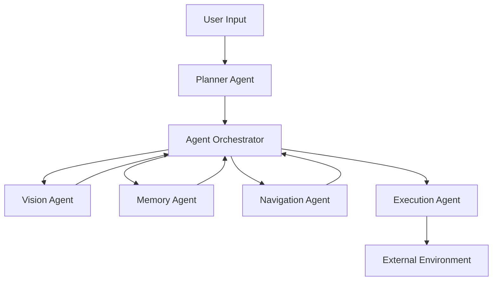
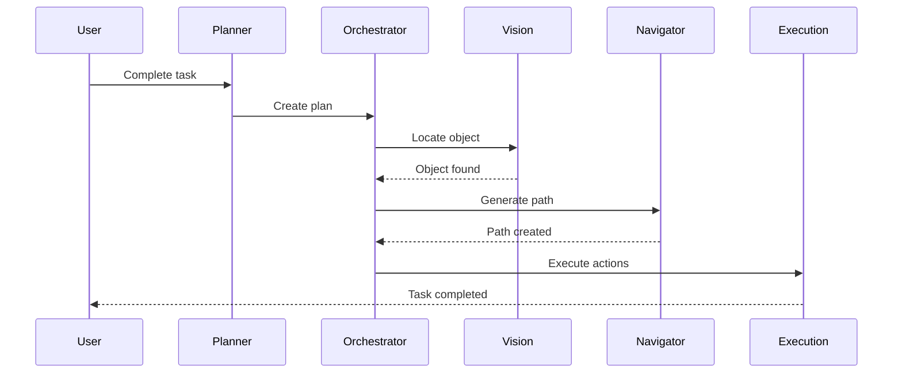
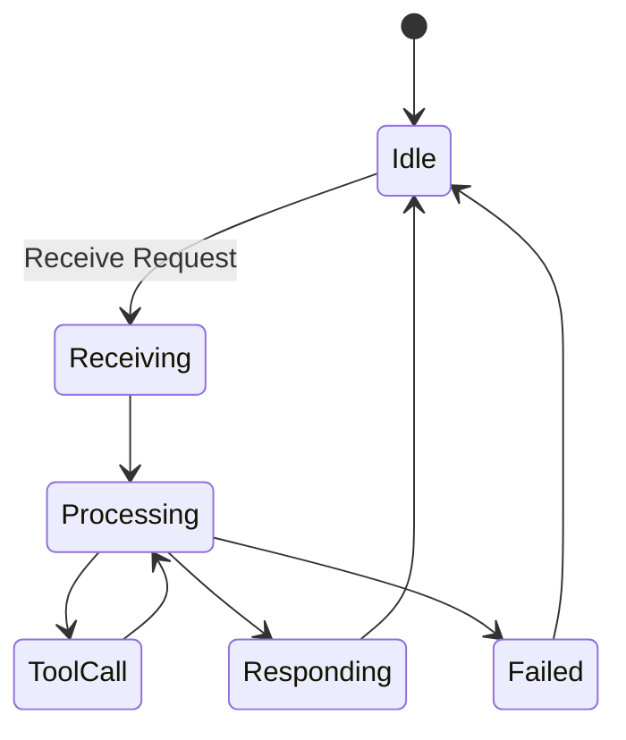

# BAI Agents
## A Modular Multi-Agent AI Orchestration Framework

<p align="center">
  <b>Building scalable AI systems through specialized autonomous agents.</b>
</p>

---

## Overview

Modern AI systems are moving away from single monolithic LLM applications toward **multi-agent architectures**, where multiple specialized agents collaborate to solve complex problems.

BAI Agents is a general-purpose multi-agent framework designed to orchestrate intelligent systems composed of:

- Planning agents
- Vision agents
- Memory agents
- Navigation agents
- Execution agents
- Tool-using agents

Instead of relying on one LLM to understand, plan, reason, and execute every task, BAI decomposes intelligence into modular components that communicate through standardized messages.

```
             User

              |
              v

        Planner Agent

              |
              v

       Agent Orchestrator

      /        |        \
     /         |         \

 Vision     Memory    Navigator
 Agent      Agent       Agent

              |
              v

       Execution Agent

              |
              v

        External World
```

---

# Motivation

Traditional LLM applications often follow this pattern:

```
User
 |
 v
LLM
 |
 v
Tools
 |
 v
Output
```

This approach becomes difficult to scale because one model must simultaneously:

- understand user intent
- maintain memory
- reason about problems
- plan actions
- interact with tools
- recover from failures

BAI instead follows a distributed intelligence model:

```
              User

               |
               v

          Planner Agent

               |
               v

        Task Orchestration

       /       |        \

  Vision    Memory   Execution

       \       |        /

          Shared Protocol
```

Each agent has a single responsibility.

---

# Key Features

## Modular Agent Architecture

Every agent follows a standardized interface.

Examples:

| Agent | Responsibility |
|---|---|
| Planner | Converts goals into executable plans |
| Vision | Understands images and environments |
| Memory | Stores and retrieves knowledge |
| Navigator | Determines movement/actions |
| Execution | Interfaces with external systems |

---

## Agent Communication

Agents communicate through structured messages.

Example request:

```json
{
  "sender": "planner",
  "receiver": "vision",
  "action": "find_object",
  "payload": {
    "object": "water bottle"
  }
}
```

Example response:

```json
{
  "sender": "vision",
  "receiver": "planner",
  "status": "success",
  "payload": {
    "location": [4.2, 1.8],
    "confidence": 0.94
  }
}
```

---

# Architecture

## High-Level System Design



---

# Core Components

---

# Planner Agent

The planner acts as the reasoning layer.

Responsibilities:

- understand user goals
- create task plans
- decompose complex objectives
- request information from other agents
- re-plan after failures


Example:

Input:

```
Bring me my backpack.
```

Planner output:

```
1. Locate backpack
2. Navigate to backpack
3. Pick up backpack
4. Return to user
```

---

# Vision Agent

Responsible for understanding the environment.

Possible implementations:

- YOLO
- Segment Anything Model
- Vision-language models
- Depth estimation


Example:

Input:

```
Find backpack
```

Output:

```json
{
 "object": "backpack",
 "position": [3.1,2.4],
 "confidence":0.92
}
```

---

# Memory Agent

Provides persistent knowledge storage.

Supports:

- short-term memory
- long-term memory
- semantic retrieval
- episodic memory


Example:

```
Planner:

Where was the backpack last seen?


Memory:

Bedroom desk at 8:00 PM.
```

---

# Navigator Agent

Responsible for planning movement.

Responsibilities:

- path planning
- obstacle avoidance
- localization
- navigation reasoning


Example:

Input:

```
Move to backpack location
```

Output:

```
Move forward 2 meters
Turn left
Avoid obstacle
```

---

# Execution Agent

The execution layer interacts with the outside world.

Examples:

- robotics hardware
- APIs
- operating systems
- simulators
- automation tools


The planner never directly controls hardware.

---

# Orchestrator

The orchestrator manages communication between agents.

Responsibilities:

- message routing
- agent discovery
- retries
- failure handling
- execution tracking


Workflow:



---

# Agent Lifecycle

Every agent follows the same lifecycle:



---

# Base Agent Interface

All agents implement:

```python
class Agent:

    def handle(self, request):
        pass

    def validate(self, request):
        pass

    def respond(self, result):
        pass
```

Example:

```python
class VisionAgent(Agent):

    def handle(self, request):

        if request.action == "find_object":
            return self.detect(
                request.payload["object"]
            )
```

---

# Repository Structure

```
BAI-agents/

├── agents/
│
│   ├── planner/
│   ├── vision/
│   ├── memory/
│   ├── navigation/
│   └── execution/
│
├── orchestrator/
│
├── communication/
│
├── protocols/
│
├── tools/
│
├── examples/
│
├── tests/
│
└── docs/
```

---

# MCP Integration

BAI is designed to support the **Model Context Protocol (MCP)**.

Current architecture:

```
Planner

 |

Python Interface

 |

Agent
```

Future architecture:

```
Planner

 |

MCP Protocol

 |

Agent Server
```

Benefits:

- remote agents
- language independence
- distributed deployment
- standardized tool access

---

# Example Applications

## Robotics

```
User

"Bring me my coffee"

        |

Planner

        |

Vision
Navigation
Execution

        |

Robot
```

---

## Personal Assistant

```
User

"Schedule my meetings"

        |

Planner

        |

Calendar Agent
Email Agent
Research Agent
```

---

## Game AI

```
Player

        |

NPC Planner

        |

Memory Agent
Decision Agent
Action Agent
```

---

# Development Roadmap

## Phase 1 - Core Framework

[x] Base Agent Interface

[x] Message Protocol

[ ] Orchestrator

[ ] Logging System


---

## Phase 2 - Intelligent Agents

[ ] Planner Agent

[ ] Memory Agent

[ ] Vision Agent

[ ] Execution Agent


---

## Phase 3 - Distributed Systems

[ ] Agent Registry

[ ] Parallel Execution

[ ] Failure Recovery

[ ] Agent Monitoring


---

## Phase 4 - MCP Integration

[ ] MCP Servers

[ ] Remote Agents

[ ] External Tool Support


---

# Design Principles

## Single Responsibility

Each agent solves one problem.

## Loose Coupling

Agents communicate through messages, not direct dependencies.

## Replaceability

Any component can be replaced without redesigning the system.

## Scalability

New capabilities are added by creating new agents.

---

# Future Work

Potential extensions:

- Learning agents
- Self-improving planners
- Multi-agent debate systems
- Distributed agent networks
- Autonomous research agents
- Long-term world models
- Reinforcement learning integration

---

# Related Projects

## BAI Robotics Platform

BAI Agents powers the multi-agent architecture behind BAI:

- YOLO perception
- Whisper speech interface
- Memory Engine
- Robot execution
- Autonomous planning


---

# Why This Project Matters

BAI Agents explores the future direction of AI engineering:

> Intelligence is not one model. Intelligence is a system of cooperating models.

By combining:

- LLM reasoning
- specialized agents
- memory systems
- tool usage
- distributed communication

BAI provides a foundation for building the next generation of autonomous AI applications.

---

# License

Apache License